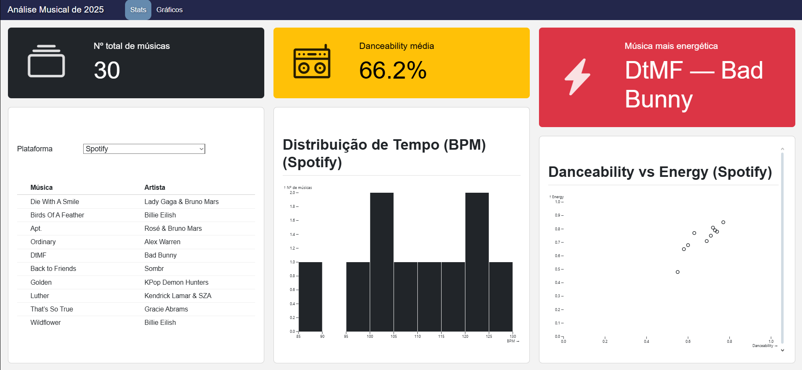

# Análise Musical de 2025

Este projeto consiste no desenvolvimento de um dashboard interativo para análise de características musicais de músicas de 2025. O trabalho foi desenvolvido recorrendo a Quarto, Python, Observable JavaScript (OJS) e D3.js. O dashboard permite explorar métricas quantitativas relacionadas com ritmo, energia e emoção musical, bem como comparar resultados entre diferentes plataformas de streaming.

## Instruções de Execução

### Requisitos
- Quarto instalado corretamente;
- Python 3.x;
- Navegador web.

### Estrutura do Projeto
- `index.qmd` – ficheiro principal do dashboard
- `data/dataset_musicas2025.json` – dataset utilizado
- `assets/css/styles.css` – estilo
- `README.md` – documentação do projeto

### Execução
Abrir uma consola na pasta do projeto e executar:

    quarto preview index.qmd

O dashboard ficará disponível num servidor local (por exemplo: http://localhost:xxxx).

## Descrição das Funcionalidades

### Estatísticas Gerais
- **Número total de músicas**  
  Calculado em Python a partir do dataset JSON e apresentado através de um value box.

- **Danceability média**  
  Média da danceability de todas as músicas, apresentada em percentagem através de um value box.

- **Música mais energética**  
  Identificação da música com maior valor de energy no dataset, apresentada num value box.

### Tabela Interativa de Músicas
- Lista dinâmica de músicas e respetivos artistas  
- Filtro por plataforma (Spotify, Apple Music e YouTube)  
- Implementada em OJS com reatividade através de um menu de seleção (dropdown)

### Visualizações de Áudio
- **Distribuição de BPM**  
  Histograma do tempo musical (BPM) por plataforma, permitindo observar a concentração de músicas em diferentes gamas rítmicas.

- **Danceability vs Energy**  
  Gráfico de dispersão que relaciona a capacidade de dança com a intensidade energética das músicas.

### Gráficos de Mood
- **Distribuição de Mood (barras)**  
  Classificação das músicas em categorias emocionais com base nos parâmetros energy e valence.

### Perfil Rítmico (D3.js)
- Gráfico circular (Pie Chart) que apresenta o perfil rítmico das músicas por plataforma.
- Métrica que combina tempo (BPM) e danceability, com as seguintes categorias:
  - Ritmo Dançável  
  - Alta Velocidade  
  - Baixa Velocidade  
  - Ritmo Moderado  

## Decisões de Design

As decisões de design adotadas neste projeto foram fundamentadas nos princípios de conceção de sistemas multimédia interativos, nomeadamente no que respeita à organização da informação, interação com o utilizador, clareza visual e redução da carga cognitiva, conforme abordado na unidade curricular.

### Organização do Dashboard

O dashboard foi estruturado em secções distintas (**Stats** e **Gráficos**), acessíveis através de uma barra de navegação, seguindo o princípio de **organização hierárquica da informação**. Esta separação permite ao utilizador distinguir rapidamente entre métricas globais e visualizações detalhadas, facilitando a exploração progressiva dos dados.

A disposição em colunas foi adotada para promover a leitura comparativa e evitar sobrecarga visual. A utilização de *value boxes* nas estatísticas iniciais fornece feedback imediato, permitindo ao utilizador obter uma visão geral do conjunto de dados sem necessidade de interação adicional.

### Escolha das Métricas

Foram privilegiadas métricas quantitativas e objetivas, diretamente extraídas das *audio features* do *dataset*, garantindo consistência e interpretabilidade dos resultados. Esta opção reduz ambiguidades e facilita a análise comparativa entre músicas e plataformas. De acordo com os princípios de design de sistemas interativos, evitou-se a repetição da mesma informação em múltiplas visualizações, assegurando que cada gráfico acrescenta valor analítico distinto. Adicionalmente, foram introduzidas métricas derivadas, como o perfil rítmico, resultantes da combinação de BPM e *danceability*.

### Escolha das Visualizações

A seleção das visualizações teve como base a adequação entre o tipo de dados e a forma gráfica utilizada, respeitando boas práticas de visualização de informação:

- Histogramas foram utilizados para representar distribuições (ex.: BPM), facilitando a perceção de padrões e concentrações.
- Gráficos de dispersão permitem analisar relações e correlações entre variáveis contínuas, como danceability e energy.
- Gráficos de barras possibilitam a comparação direta entre categorias, como os diferentes estados de *mood*.
- Um gráfico circular (Pie Chart) em D3.js foi introduzido para representar uma métrica conceptual distinta, oferecendo variedade visual e incentivando a exploração do dashboard.

A utilização de diferentes tipos de gráficos contribui para uma experiência multimédia mais rica, mantendo a coerência visual e respeitando o princípio de diversidade controlada.

### Tecnologias Utilizadas
- Python para cálculos agregados e métricas globais
- Observable Javascript para apresentação de tabelas
- Observable para visualizações de estatísticas
- D3.js para gráficos personalizados
- CSS personalizado para garantir coerência visual do dashboard

## Nota Final

Este projeto não avalia a qualidade musical das faixas analisadas, mas sim características quantitativas do áudio, permitindo uma análise comparativa entre músicas e plataformas de streaming, com foco na exploração visual dos dados.
